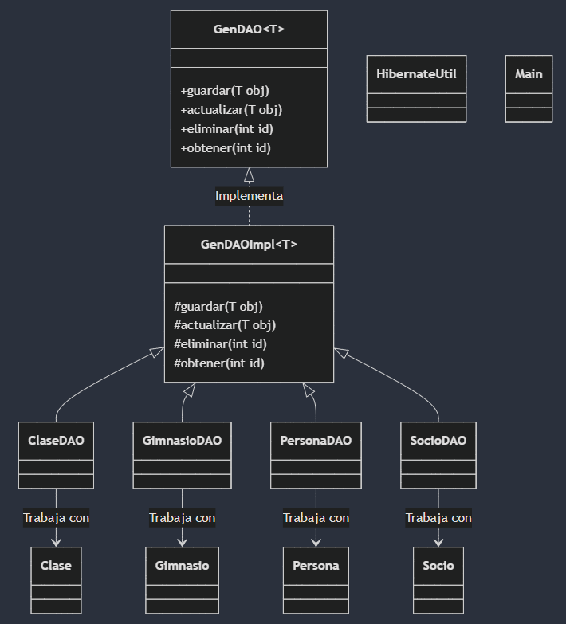

# PATRON DAO

# Pregunta 1:

Su principal función es aislar la lógica de persistencia del resto de la aplicación, proporcionando una abstracción sobre la base de datos o cualquier otro sistema de almacenamiento.

a) Encapsular el acceso a datos: Maneja todas las operaciones CRUD (Create, Read, Update, Delete) sobre una entidad sin exponer los detalles internos de la base de datos.
b) Mantiene el código limpio y modular, facilitando el mantenimiento y la evolución del sistema.

# Pregunta 2:

Ayuda a estructurar mejor una aplicación dividiendo responsabilidades, lo que hace que el código sea más mantenible, flexible y escalable.

a) Permite que la lógica de negocio no dependa de detalles de implementación de la base de datos.
b) Si se cambia la base de datos o la tecnología de acceso, solo se modifica el DAO, sin afectar el resto de la aplicación.
c) Un DAO bien diseñado puede ser reutilizado en diferentes partes del sistema sin duplicar código.
d) Al encapsular las consultas SQL en un solo lugar, se pueden prevenir inyecciones SQL con el uso de consultas preparadas.
e) Al separar la capa de acceso a datos, se pueden hacer pruebas unitarias simulando el DAO con mocking.

# Pregunta 3:

a) No se realizo ni un cambio en el codigo Main 
b) Se modifico las clases DAO, extendiendo de la clase GenDAOImpl para que implementa la interface GenDAO y utiliza los metodos heredados.
c) Los controladores se mantienen igual

# Pregunta 4:

# Pregunta 5:

La clase abstracta es útil, pero no indispensable. Todo dependerá de la estructura del proyecto y de los objetivos de mantenibilidad y escalabilidad. Una clase abstracta en un DAO permite definir una estructura común para todos los DAOs de distintas entidades. Generalmente, incluye métodos básicos como create(), read(), update() y delete(), evitando así duplicación de código.